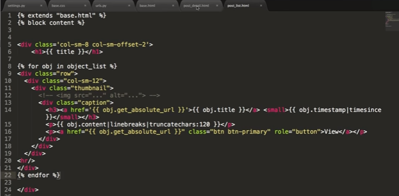

#  Implement Bootstrap

## download Bootstrap, and add it to the base.html
http://v3.bootcss.com/getting-started/#download
```
<!-- 新 Bootstrap 核心 CSS 文件 -->
<link rel="stylesheet" href="http://cdn.bootcss.com/bootstrap/3.3.0/css/bootstrap.min.css">

<!-- 可选的Bootstrap主题文件（一般不用引入） -->
<link rel="stylesheet" href="http://cdn.bootcss.com/bootstrap/3.3.0/css/bootstrap-theme.min.css">

<!-- jQuery文件。务必在bootstrap.min.js 之前引入 -->
<script src="http://cdn.bootcss.com/jquery/1.11.1/jquery.min.js"></script>

<!-- 最新的 Bootstrap 核心 JavaScript 文件 -->
<script src="http://cdn.bootcss.com/bootstrap/3.3.0/js/bootstrap.min.js"></script>
```

## modify in detail page

```


<div class="col-sm-6 col-sm-offset-3">
   <h1> {{ obj.title }} <small>{{ obj.updated }}</small> </h1>
    {{ obj.content | linebreaks }} <br>
</div>

```

## modify list page



## modify form page
